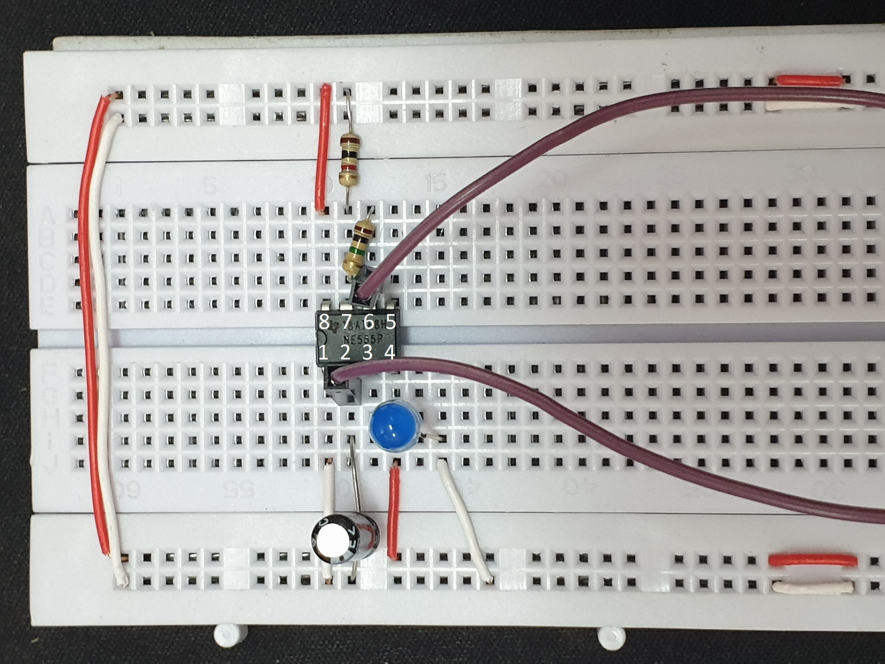
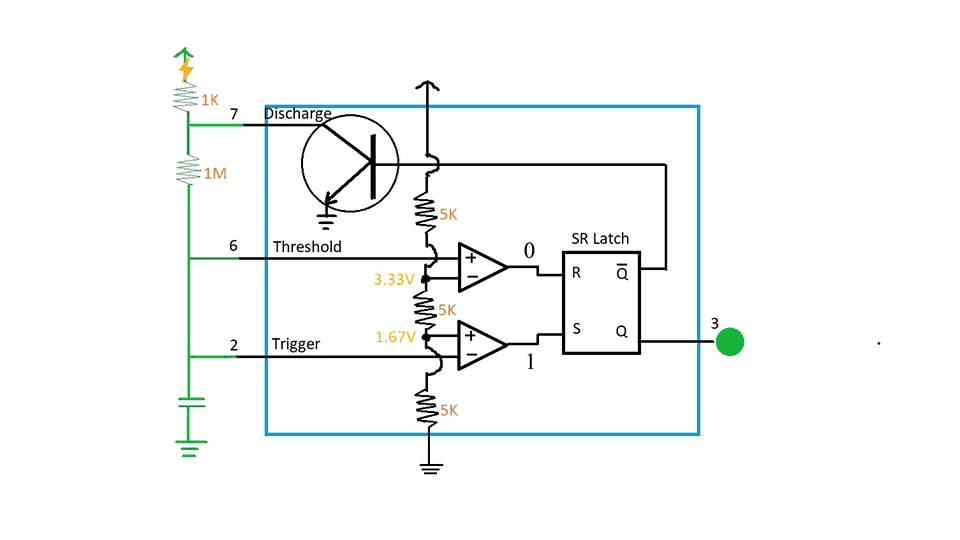

# Clock Module

## SR Latch
This one is how SR latch works

## 555 Timer Circuit

There are a lot of ways to build a clock for the computer. But we want the clock to be relatively flexible. We want to be able to adjust the speed. We do not want it to run too fast. One way to do it is using the classic 555 timer.

The 555 timer is powered by a 5V goes to pin 5 and and grounded to pin 1. And to control the timing, we have two resitors, 1k Ohm resistor goes from 5V to pin 6 and 1M Ohm resistor goes from pin 6 to pin 7 of the chip. Pin 7 and pin 2 are connected by the purple wire like above. A capacitor 1μF goes from pin 2 to ground. And the output of the chip is connected to an LED.

This diagram is one way to understand what is going on inside the 555 timer.

